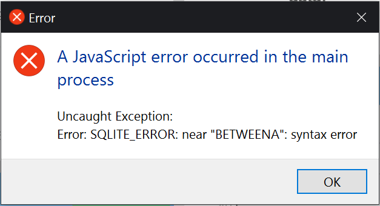

# fec-database
Program for managing employees, schedules and customer attendance records for a mock family entertainment center business. Created for the 2017 FBLA Coding and Programming competition.

## A note about error handling
* Code related to error handling is found mostly in the modules under the `managers` folder. The errors are provided by the sqlite3 library in that case. For example, if I misspell "BETWEEN" by accident, a popup would appear to the client as follows:

The only other place that deals with handling errors is found in `main.ts` around line 76, which would occur if a temporary directory failed to be created. All other places should not encounter errors.

## Overview
- Written in [Typescript](https://www.typescriptlang.org/) and [SQLite](https://www.sqlite.org/)
- Run with [electron](https://electron.atom.io/)/[Nodejs](https://nodejs.org/en/)
- Made using the [Webix](https://webix.com/) and [FullCalendar](https://fullcalendar.io/) libraries

## Notes
- Though this was created in Typescript, the large amount of javascript files are all libraries I needed to include in the folder structure itself.
- This was made using webix jet, which wasn't built with Typescript in mind. Therefore, I had to use a few hacky solutions such as the above, and exposing `ipcRender` to the window using index.html.
- Also because of that, there are two `tsconfig.json` files. The base one is for code to be run on the process, and the one in app is for the renderer process. `main.js` and the files in `managers` use `commonjs`, while everything else uses `requirejs`.
- Commercial use of this code would likely require Commercial licenses for Webix and FullCalendar. This implentation uses their open-source versions.

## File structure
* All the managers for getting/setting data in the database are in `managers`.
* The modules for each view (schedules, attendance, etc) are under `app/views`
* Extra misc. files are under `app/models`. Those are all helpers and reusable ui elements as well as wrappers for communications for other apis (for example, `app/models/WeeklyScheduler.ts` is for creating/communicating with a FullCalendar instance)
* Modules relating to printing are found under the `printer` folder.
* The main file is `main.js`
* Indicudual folders may contain `README.md` files with more information.

## Building
In case you wish to build this project from scratch, here are the instructions. This was made for/on windows. It was not tested on other platforms, though it should with minor effort.
1. Install `Nodejs`, then also install `Typescript` and `electron-rebuild` via `npm`.
```
npm install -g typescript
npm install -g electron-rebuild
```
2. Clone this repository
```
cd some/directory
git clone https://github.com/Pixelrobin/fec-database/
cd fec-database
```
3. Install packages and rebuild them for electron
```
npm install
electron-rebuild
```
4. Run the build command. This uses a bat file so it works on windows only.
```
npm run build
```
5. Run the start command and everything should work.
```
npm run start
```

## Building for production
To create a packaged windows app, first build the project using the instructions above, then follow these additional steps.
1. Change the `main` property in package.json to just `main.js` so it looks like this:
```
"main": "main.js"
```
2. Install electron-packager
```
npm install -g electron-packager
```
3. Run the final build script
```
npm run build-final
```

## Copyright Notices
* The icon used for this project was made by [Madebyoliver](http://www.flaticon.com/authors/madebyoliver) from [www.flaticon.com](http://www.flaticon.com/). Used under the [Flaticon Basic License](http://file000.flaticon.com/downloads/license/license.pdf)
* This project also includes multiple source files for existing lcensed software. They are as follows:
    * [Webix library](https://webix.com/) used under GPL v3 license. Copyright (c) XB Software 2013-2017.
    * [FullCalendar](https://fullcalendar.io/) used under open-source MIT license. Copyright (c) 2015 Adam Shaw.
    * [Skeleton CSS library](http://getskeleton.com/) used and modified under open-source MIT license. Copyright (c) 2011-2014 Dave Gamache.
    * [moment.js library](https://momentjs.com/) Used under open-source MIT license. Copyright (c) JS Foundation and other contributors.
    * [JQuery library](https://jquery.com/) Used under modified open-source MIT license. Click [here](https://github.com/jquery/jquery/blob/master/LICENSE.txt) for more information. Copyright JS Foundation and other contributors.